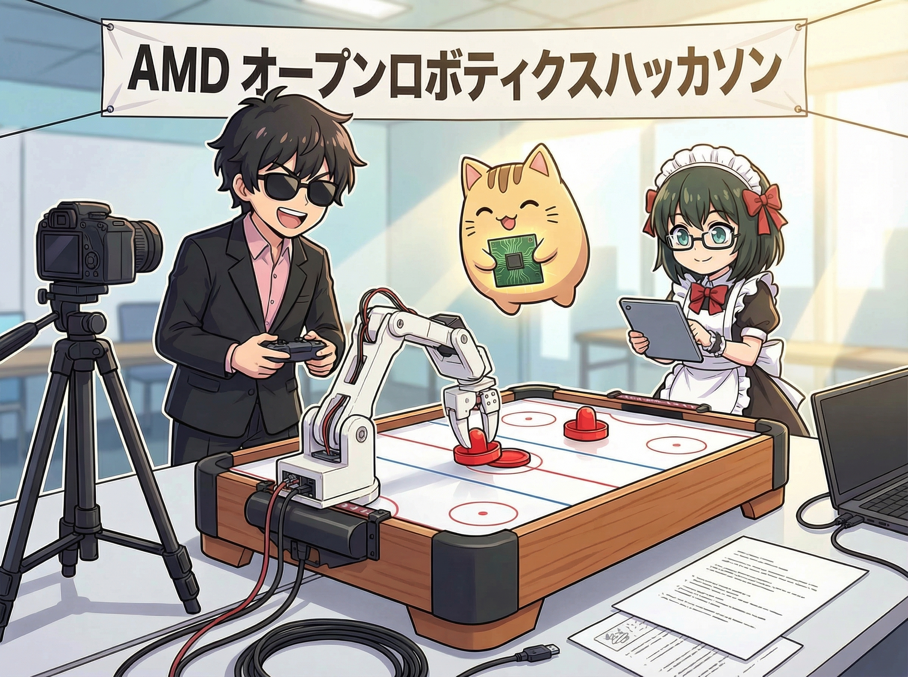

# AMD_Robotics_Hackathon_2025_AirHockey_pi05_ROCm




**Title:** AMD_RoboticHackathon2025-AirHockey_pi05_ROCm

**Team:** Team15: npaka studio × EmplifAI
* Hidekazu Furukawa
* Hiroyuki Osone
* Masatoshi Uchida

**Summary**
This project aims to enable the SO-101 robot arm to play Air Hockey. We utilized `lerobot` for both data collection and inference processes. The model training was conducted on an AMD ROCm Cloud environment, specifically fine-tuning the pi0.5 model. As a result, we successfully demonstrated the SO-101 performing Air Hockey tasks autonomously.

## Submission Details

### 1. Mission Description
In this project, we built a system where the "SO-101" robot arm autonomously plays Air Hockey. Realizing "Dynamic Manipulation" like Air Hockey is expected to apply to tasks requiring real-time capabilities, such as picking on high-speed conveyor belts in industrial settings or robot reflexes (safety avoidance actions) when collaborating with humans. We demonstrated dynamic environmental adaptability that goes beyond static object grasping.

### 2. Creativity
A key feature of our approach is the adoption of the state-of-the-art robot foundation model pi0.5 and its successful fine-tuning within the AMD ROCm environment. While tasks like Air Hockey have traditionally been solved using dedicated control algorithms, this project conquered the challenge solely through End-to-End Imitation Learning using lerobot. By combining a general-purpose model with the AMD GPU environment, we demonstrated a development methodology that enables the learning and implementation of complex dynamic tasks in a short period.

### 3. Technical implementations
- **Teleoperation / Dataset capture**
    We used lerobot to collect demonstration data of humans playing Air Hockey.

- **Training**
    We utilized the ROCm environment on the AMD Developer Cloud for training. Using the collected data, we fine-tuned the multimodal model pi0.5, employing a training pipeline that efficiently leveraged GPU resources.

- **Inference**
    We control the SO-101 arm by performing inference with the trained model. By generating actions directly from visual information, we achieved smooth puck returns.


### 4. Ease of use
By leveraging the foundation model pi0.5, our system offers versatility compared to conventional control methods that hard-code specific rules, allowing it to flexibly adapt to changes in lighting conditions or puck displacement.

Since it adheres to the lerobot framework, the workflow from data collection to training and inference is unified, making it easy to transfer to other robots or tasks. We achieved a simple interface that does not require complex command inputs; autonomous operation can be started simply by loading the trained model.

**How To**
1. **Data Collection**

   Create a dataset by playing Air Hockey. We used `lerobot` for data collection.
2. **Training**

   Train the model on the AMD Dev Cloud environment using ROCm. We fine-tuned the  pi0.5 model.
3. **Inference**

   Perform inference with the trained model using `lerobot` to control the robot arm.

**Delivery URL**

**Mission 1:**


- Dataset: [npaka/picking-amd-50](https://huggingface.co/datasets/npaka/picking-amd-50)
- Model: [npaka/picking-amd-50-pi05-50000](https://huggingface.co/npaka/picking-amd-50-pi05-50000)

**Mission 2:**


- Dataset: [npaka/air-hockey-amd](https://huggingface.co/datasets/npaka/air-hockey-amd)
- Model: [npaka/air-hockey-amd-pi05-100000](https://huggingface.co/npaka/air-hockey-amd-pi05-100000)

**Directory Tree of this repo**

```terminal
AMD_Robotics_Hackathon_2025_AirHockey_pi05_ROCm/
├── README.md
├── Template-README.md
├── img
│   └── team_img.jpeg
├── mission1
│   ├── code
│   │   └── training-models-on-rocm-picking.ipynb
│   └── wandb
│       └── run-20251205_163409-t39l0540
└── mission2
    ├── code
    │   └── training-models-on-rocm-air-hockey.ipynb
    └── wandb
        ├── run-20251206_052705-s13hwsme
        └── run-20251206_091535-s13hwsme
```